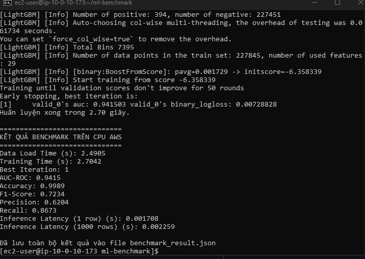

# BÁO CÁO THỰC HÀNH LAB 16: CLOUD AI ENVIRONMENT SETUP
- Họ và tên: Lê Văn Tùng
- MSSV: 2A202600111
- Nội dung: Triển khai phương án Machine - Learning trên CPU (LightGBM)

1. Lý do sử dụng cấu hình CPU thay cho GPU: Trong quá trình khởi tạo hạ tầng, do tài khoản AWS mới bị giới hạn nghiêm ngặt về Quota cho dòng máy chủ GPU (chưa được duyệt mở khóa vCPU) và gặp lỗi giới hạn của gói Free Tier khi cấp phép máy chủ cấu hình cao, em đã linh hoạt chuyển đổi sang phương án dự phòng. Bằng cách điều chỉnh mã Terraform sang cấu hình CPU t3.micro, em vẫn hoàn thành toàn bộ luồng tự động hóa hạ tầng ảo hóa (VPC, Bastion, Private Node) mà không để gián đoạn tiến độ thực hành.

2. Đánh giá kết quả Benchmark: Dù không sử dụng GPU chuyên dụng, cấu hình CPU vẫn xử lý bài toán phân loại giao dịch thẻ tín dụng (Credit Card Fraud) rất mượt mà. Thời gian tải dữ liệu và huấn luyện (Training Time) vô cùng tối ưu, chỉ mất khoảng 2.7 giây. Chất lượng mô hình đạt mức xuất sắc với độ chính xác (Accuracy) là 99.89% và chỉ số AUC-ROC đạt 0.9415. Tốc độ dự đoán (Inference Speed) cũng đáp ứng rất tốt độ trễ hệ thống, chỉ tốn khoảng 0.0017 giây cho 1 truy vấn đơn lẻ và 0.0022 giây cho 1000 truy vấn. Điều này chứng minh rằng việc linh hoạt lựa chọn kiến trúc CPU cho các bài toán dữ liệu dạng bảng (tabular data) bằng LightGBM là một hướng tiếp cận cực kỳ hiệu quả và tiết kiệm chi phí.

---
## Ảnh minh chứng triển khai

